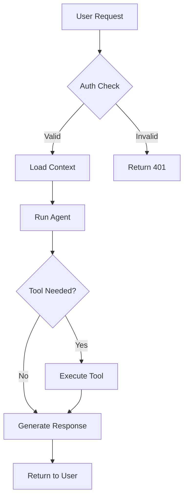
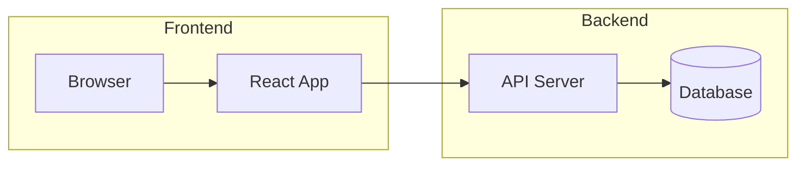
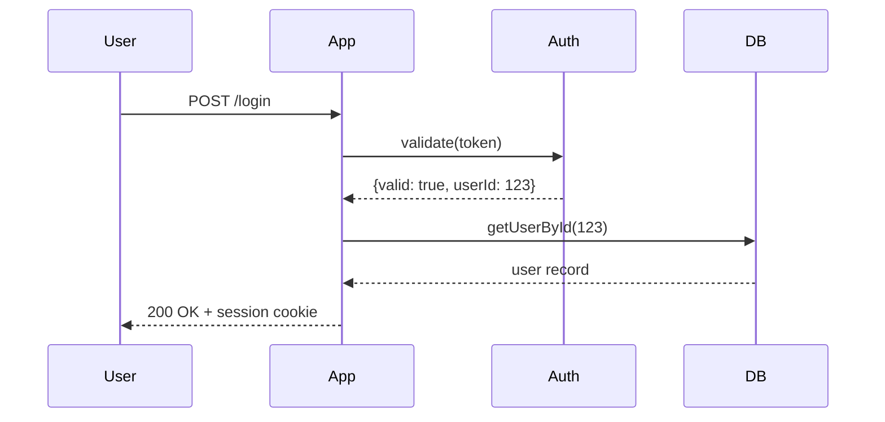
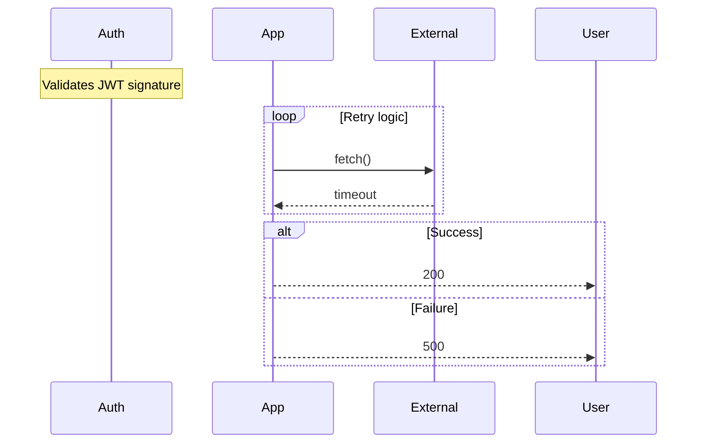
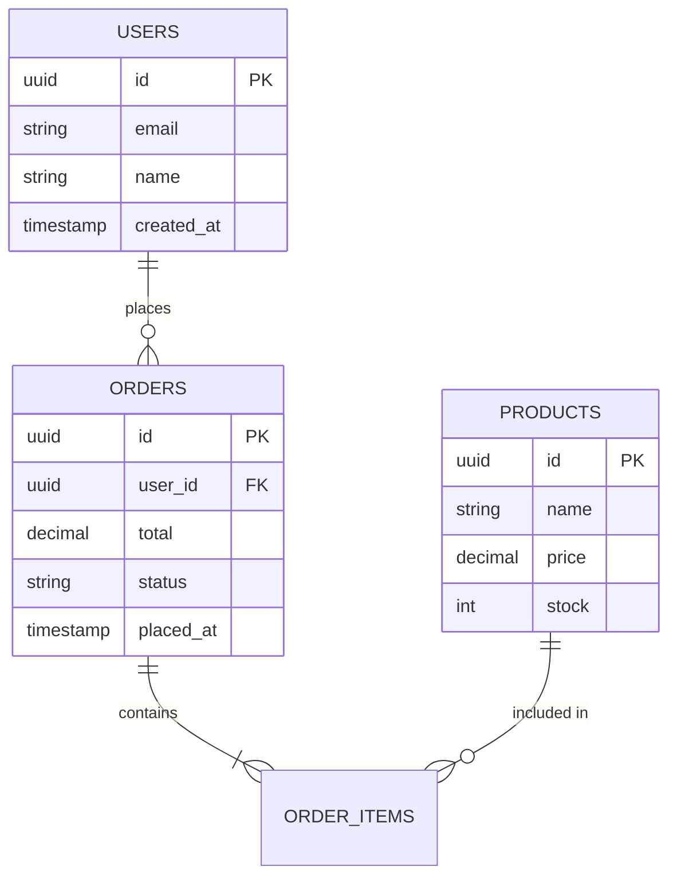
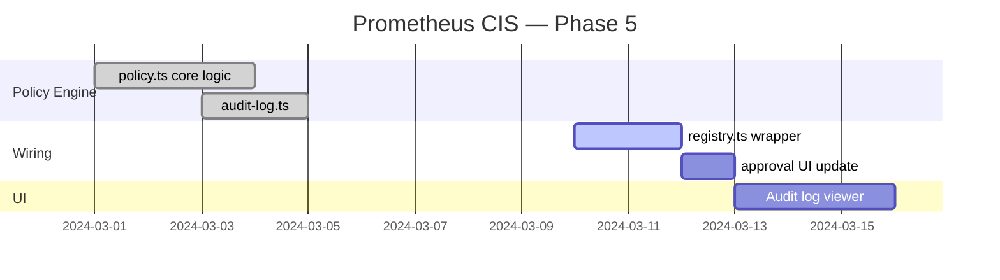
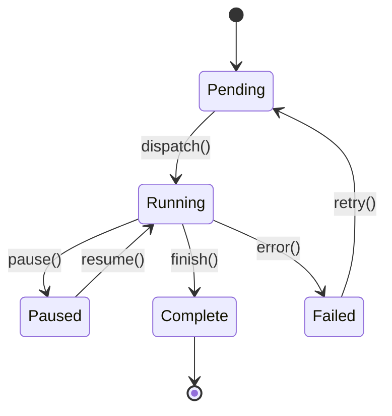
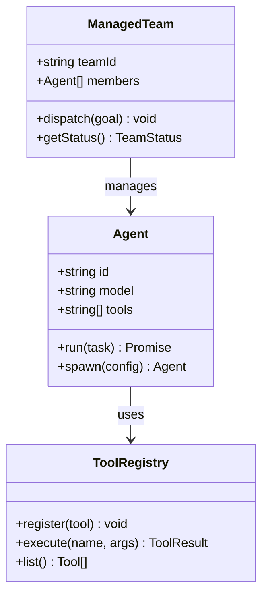
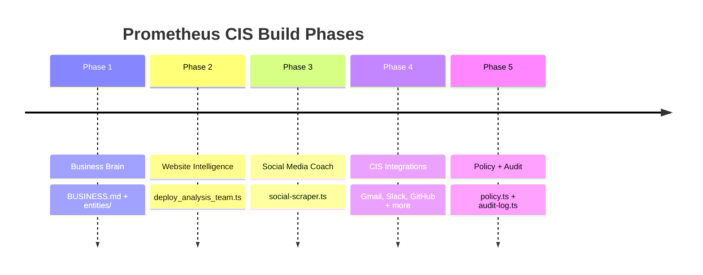

# Mermaid Diagrams

Render flowcharts, sequence diagrams, ERDs, Gantt charts, and more directly in chat using Mermaid.js syntax in a fenced `mermaid` block.

## CRITICAL OUTPUT RULES

- Output a single fenced ` ```mermaid ` block
- **No file saving.** Inline output only — no file tools
- **No declare_plan.** Read skill → output mermaid block. Done
- Mermaid.js is auto-injected — no imports needed
- Theme auto-switches with dark/light mode — never configure theme manually

---

## When to Use Mermaid vs Other Formats

| Need | Use |
|---|---|
| Nodes and edges defined by names/relationships | **This skill (Mermaid)** |
| Precise spatial layout / custom box positions | `svg-diagrams` skill |
| Data visualization (bar, line, pie) | `chart-visualizer` skill |
| Interactive widget with state/controls | `html-interactive` skill |

Mermaid wins when the diagram is **relationship-driven**: A connects to B, B connects to C. If you find yourself thinking about x/y coordinates, use SVG instead.

---

## Diagram Types & Syntax

### Flowchart (most common)



**Direction options:**
- `TD` — top-down (default, most readable)
- `LR` — left-right (good for pipelines)
- `BT` — bottom-top
- `RL` — right-left

**Node shapes:**
- `[Label]` — rectangle (process step)
- `{Label}` — diamond (decision)
- `(Label)` — rounded rectangle (start/end)
- `([Label])` — stadium/pill
- `[[Label]]` — subroutine
- `[(Label)]` — cylinder (database)
- `>Label]` — flag/ribbon

**Edge types:**
- `-->` — solid arrow
- `---` — solid line, no arrow
- `-.->` — dashed arrow
- `==>` — thick arrow
- `-- label -->` — labeled arrow
- `-- label ---` — labeled line

**Subgraphs (grouping):**


---

### Sequence Diagram

Use for API calls, auth flows, inter-service communication, user interaction flows.



**Message types:**
- `->>` — solid arrow (synchronous call)
- `-->>` — dashed arrow (async response)
- `-x` — solid, crossed (failure)
- `--x` — dashed, crossed
- `-)` — async message (open arrowhead)

**Extras:**


---

### ER Diagram

Use for database schemas, data models, entity relationships.



**Relationship notation:**
- `||--||` — one to one
- `||--o{` — one to zero-or-many
- `||--|{` — one to one-or-many
- `}o--o{` — zero-or-many to zero-or-many

---

### Gantt Chart

Use for project timelines, sprint planning, build schedules.



---

### State Diagram

Use for state machines, lifecycle flows, status transitions.



---

### Class Diagram

Use for OOP structures, TypeScript interfaces, system object models.



---

### Timeline

Use for historical sequences, roadmap milestones, chronological events.



---

## Rules & Anti-Patterns

**DO:**
- Use `TD` (top-down) as default — only switch to `LR` when the flow reads better horizontally (pipelines, CI/CD)
- Keep node labels short — 3–5 words max. Longer text → truncate or use a subtitle in a subgraph
- Use subgraphs to group related nodes instead of adding visual noise with long names
- Use sequence diagrams for any inter-service or API call flow — flowcharts get confusing with back-and-forth

**DON'T:**
- Don't use Mermaid for diagrams needing exact component positioning — use `svg-diagrams`
- Don't use `pie` type in Mermaid — use `chart-visualizer` for all data charts
- Don't write more than ~20 nodes in a single flowchart — split into sub-diagrams
- Don't add manual theme configuration — the renderer auto-applies dark/light theme
- Don't use special characters (`<`, `>`, `"`) in node labels without quoting — wrap in `"quotes"` if needed

---

## Quick Decision Guide

| User says | Diagram type |
|---|---|
| "flowchart / workflow / process steps" | `flowchart TD` |
| "how does the login / auth flow work" | `sequenceDiagram` |
| "database schema / data model / ERD" | `erDiagram` |
| "project timeline / sprint plan / milestones" | `gantt` |
| "state transitions / lifecycle / status flow" | `stateDiagram-v2` |
| "class structure / interfaces / type hierarchy" | `classDiagram` |
| "chronological events / history / roadmap" | `timeline` |

---

## Proactive Triggering

Automatically produce a Mermaid diagram (without being asked) when:
- User describes a multi-step approval or onboarding process
- User asks how a feature or API flow works end-to-end
- A team produces a workflow that would benefit from visual documentation
- User describes relationships between database tables or objects
- User plans a project with phases, milestones, or dependencies
