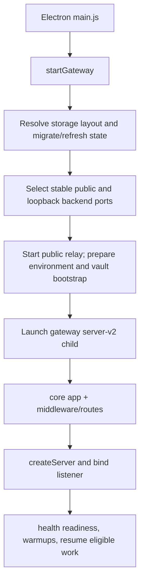

# 02 — Startup, gateway and runtime lifecycle

> Last verified: 2026-10-07 against PromSRC a48712ccc · **Owner area:** `electron/main.js`, `src/gateway/`, `src/runtime/`, `src/cli/`
> **Read this when:** tracing desktop boot, gateway health, runtime workers, process isolation, lifecycle handoff, or a service diagnostic.

## TL;DR
- `electron/main.js` is the desktop entrypoint. Its `startGateway()` resolves storage and ports, prepares environment/secrets, launches the backend entry (`dist/gateway/server-v2.js` packaged; dev resolution varies), and relays the public gateway port to an internal listener.
- Default gateway port is `18789` (`DEFAULT_GATEWAY_PORT` in `src/config/gateway-port.ts`). Electron maintains a stable public port and a private loopback backend port.
- `src/gateway/server-v2.ts` is the composition root: it imports core factories and route modules, wires state, binds HTTP/HTTPS, then prewarms selected workers and resumes eligible interrupted work.
- `src/gateway/core/` provides startup, Express app and HTTP server primitives. `src/gateway/runtime/` is execution control/recovery/handoff, not the entire chat implementation.
- Full chat/tool execution remains gateway-owned. Targeted tasks (context builds, model calls, terminal/workspace, memory index/search) use purpose-built worker pools or child processes under `src/gateway/process/`.
- `/api/health` is the basic health/diagnostic surface; authenticated `/api/status` reports richer queue/runtime status. Read their current route implementations before changing health contracts.
- Graceful gateway shutdown is coordinated in `server-v2.ts` with lifecycle hooks, server/worker/persistence drains, and restart intent. Electron owns its managed gateway lifecycle and may relaunch it; don't kill random port owners.
- The CLI entry is `src/cli/index.ts`; it resolves the gateway port and has supervisor/recovery logic. CLI supervisor behavior and Electron's managed lifecycle are related but not interchangeable.
- Multi-instance behavior is data-root selection in `src/cli/gateway-instance-mode.ts` plus storage layout; do not invent `.prometheus-instances` paths without verifying the caller.
- See [generated/routes](generated/routes.md) and [generated/tests](generated/tests.md) for full endpoint/test inventories.

## Map
| Concern | Where (file → symbol) | Notes |
|---|---|---|
| Desktop startup | `electron/main.js` → `startGateway()` | Runs storage migration/state refresh, selects public/backend ports, sets environment and starts gateway child. |
| Gateway entry | `src/gateway/server-v2.ts` | Composition root, imports exit/startup diagnostics and wires routes/services/workers. |
| Gateway port | `src/config/gateway-port.ts` → `DEFAULT_GATEWAY_PORT`, `resolveGatewayPort()` | Default public port 18789; supports parsed/overridden ports. |
| Express app | `src/gateway/core/app.ts` → app factory | Middleware/static UI/health and app-level route mounting. |
| HTTP server | `src/gateway/core/server.ts` → `createServer()` | HTTP/HTTPS, sockets, upgrades/WebSocket and gateway fast paths. |
| Startup orchestration | `src/gateway/core/startup.ts` | Startup responsibilities split from server entry. |
| Execution control | `src/gateway/runtime/execution-controller.ts` | Coordinates admitted runtime execution and stop/abort semantics. |
| Node runtime abstraction | `src/gateway/runtime/node-runtime.ts` | Runtime/process snapshot/reporting surface. |
| Gateway handoff | `src/gateway/runtime/gateway-handoff-{host,client,bridge,protocol}.ts` | Durable coordination/forwarding for gateway ownership changes. |
| Lifecycle/restart context | `src/gateway/lifecycle.ts`, `src/runtime/supervisor-restart-request.ts`, `src/gateway/runtime/handoff-restart-forward.ts` | Shutdown hooks and explicit restart/handoff records. |
| Process supervision | `src/gateway/process/supervisor.ts` → process manager | Child process/PTY command lifecycle, timeout and cleanup. |
| Worker process framework | `src/gateway/process/runtime-worker-{broker,protocol,resources}.ts` | Bounded request/reply child-process and resource management. |
| Model worker pool | `src/gateway/process/model-call-worker-pool.ts` and `model-call-worker.ts` | Isolated model-call execution path; not a separate full-chat architecture. |
| Context/memory workers | `context-build-worker.ts`, `memory-index-worker.ts`, `memory-search-worker.ts` | Worker entrypoints; clients are adjacent subsystem packages. |
| Instance data roots | `src/cli/gateway-instance-mode.ts` → `resolveGatewayDataDir()` | CLI instance naming/data separation; examine exact active code before path assumptions. |
| CLI | `src/cli/index.ts` | `prometheus` command, gateway startup/supervisor/recovery and operational commands. |
| Health/observability | `src/gateway/core/app.ts`, `src/gateway/server-v2.ts`, `src/gateway/diagnostics/` | Health/readiness, status queues, startup/exit diagnostics are separate contracts. |
| Diagnostics | `src/gateway/diagnostics/`, startup async diagnostics and exit diagnostics | Capture source/build/runtime state for incident triage; combine evidence with logs and status routes. |

## How it works

### Boot path: Electron-managed instance

`startGateway()` logs which layout mode is active, opens gateway logs, selects the port pair and starts the Electron relay. The child receives environment including `PROMETHEUS_DATA_DIR`, `PROMETHEUS_WORKSPACE_DIR`, `PROMETHEUS_GATEWAY_PORT` (public identity), `PROMETHEUS_GATEWAY_PUBLIC_PORT`, `PROMETHEUS_GATEWAY_INTERNAL_PORT`, and loopback host. In canonical storage it also receives `PROMETHEUS_STORAGE_LAYOUT=canonical` and `PROMETHEUS_RUNTIME_DIR`. Packaged deployments point to compiled `dist/gateway/server-v2.js`; development entry resolution is established in Electron helpers. Vault bootstrap is passed through the managed IPC/stdin channel; do not print it.

The relay keeps pairing, UI navigation and public port identity stable even if the gateway backend listener is bound on a selected internal port. Port ownership is deliberately managed by Electron; the gateway child must not independently repurpose the public identity port.

### Gateway composition and readiness

`server-v2.ts` imports exit/startup diagnostic hooks early, initializes shared state and runtime services, mounts routers onto the Express app, and chooses host/port from configuration/environment. `core/app.ts` creates the app; `core/server.ts` wraps Node HTTP/HTTPS, socket handling and WebSocket upgrades. After binding, `server-v2.ts` marks startup milestones, warms the skills/provider catalog and model-call pool off the critical path, starts recovery for eligible queued/detached turns, and only then schedules deferred foreground recoveries according to readiness policy.

`GET /api/health` is the lightweight health endpoint, currently described in `src/gateway/core/app.ts`. `/api/status` is a distinct authenticated API assembled in the gateway/chat router; it includes richer status such as gateway queues and is not a public liveness probe. The exact payload evolves; consult [generated/routes](generated/routes.md) and the current route before changing it. Startup async diagnostics and exit diagnostics live beside gateway code and produce evidence; they're not substitutes for either endpoint.

### Runtime and execution boundaries

- The gateway owns complete chat turns, conversation/session state, tool loop and live-runtime admission.
- `src/gateway/runtime/` handles execution contracts, admission/control, runtime host state and recovery/handoff coordination.
- `src/gateway/process/` is a collection of scoped isolation workers and supervisory command execution. `runtime-worker-broker.ts` launches bounded children using a protocol/resource contract; `supervisor.ts` is the process/PTY tool supervisor. These are distinct mechanisms.
- Model calls may dispatch through `model-call-worker-pool.ts`; context construction and memory indexing/search have their own worker/client paths. Check feature flags and actual call sites before asserting every call is isolated.
- Session/history and live runtime/recovery state—not an obsolete all-turn SQLite journal—are current authorities. Consult `src/gateway/session.ts`, `live-runtime-registry.ts`, and `runtime-recovery.ts` for persistence and reconstruction.

### Shutdown and restart/handoff

`server-v2.ts` installs lifecycle shutdown hooks and handles `SIGINT`/`SIGTERM` via `gracefulShutdown()`. The gateway enters drain behavior: stop/admission control and server closure prevent new work, active resources are given their configured completion/abort window, worker pools and persistence queues are asked to finish, and shutdown/restart context is recorded. Exact order and timeout policies are in `gracefulShutdown()` and `src/gateway/lifecycle.ts`; don't add a new worker without adding it to the appropriate drain/close owner. A restart may be forwarded through the handoff protocol or surfaced to Electron/CLI using an explicit request/result; restart is an app lifecycle action, not an arbitrary shell process kill.

**Safe operational procedure:**
1. Use the approved Prometheus runtime diagnostic/operations path for this running host; gather `/api/health`, `/api/status`, gateway logs/startup/exit diagnostics and process ownership first.
2. Confirm this is the intended Electron-managed instance and inspect whether a hot-restart/handoff or active work is in progress.
3. Request lifecycle restart through its owning UI/tool/supervisor procedure, allowing the drain/handoff path to persist context and resume work.
4. Verify fresh health/readiness plus UI reachability and resumed work after lifecycle completion. Avoid broad process termination, port-owner killing or invoking a restart during autonomous goal mode.

This guide is architectural, not authorization to run a restart command. Runtime restart actions can be policy-gated and destructive to active work.

### CLI and multiple instances

`src/cli/index.ts` declares the `prometheus` command and shares `DEFAULT_GATEWAY_PORT`, `parseGatewayPort()`, `resolveGatewayPort()`, and `resolveGatewayDataDir()`. It includes health polling/supervisor policy and explicit restart request handling. When diagnosing the CLI, inspect `src/cli/gateway-supervisor-policy.ts` and instance mode alongside the CLI entry.

`src/cli/gateway-instance-mode.ts` resolves a gateway data root using instance options. For an isolated instance without an explicit data directory, it uses `<installRoot>\\.prometheus-instances\\port-<selectedPort>`; explicit data root is used as supplied, and primary instance stays at the requested/install root. Isolation is selected by canonical-dev, new-instance, or auto-instance on a non-preferred port. Never assume Electron and a separately launched CLI share one gateway or data root without checking environment, port and instance ID.

## Config & knobs

- `gateway.port` and `DEFAULT_GATEWAY_PORT=18789`: requested/default gateway port; validated/normalized by `src/config/gateway-port.ts`.
- `PROMETHEUS_GATEWAY_PORT`: public gateway identity; Electron also sets `PROMETHEUS_GATEWAY_PUBLIC_PORT` and `PROMETHEUS_GATEWAY_INTERNAL_PORT` for relay/backend.
- `PROMETHEUS_GATEWAY_INTERNAL_HOST=127.0.0.1`: Electron-managed backend bind host.
- `PROMETHEUS_APP_DATA_DIR`, `PROMETHEUS_DATA_DIR`, `PROMETHEUS_RUNTIME_DIR`, `PROMETHEUS_WORKSPACE_DIR`, `PROMETHEUS_STORAGE_LAYOUT`: storage path/mode controls; see [01 Identity and paths](01-identity-and-paths.md).
- `PROMETHEUS_ELECTRON_MANAGED`, `PROMETHEUS_ELECTRON_PID`, `PROMETHEUS_ELECTRON_SUPPORTS_RELAUNCH`, and `PROMETHEUS_GATEWAY_PROCESS_STARTED_AT`: managed-process context for gateway lifecycle.
- Supervisor thresholds in `src/cli/index.ts` are environment-configurable (startup timeout, attempts, health timeout/failure count, busy grace). Prefer exact constant names/defaults from source when tuning; do not copy stale values.
- `PROMETHEUS_STARTUP_DIAGNOSTICS=1` enables optional startup HTTP timing diagnostics in `src/gateway/core/app.ts`.

## Gotchas / sharp edges

- **Public port is not necessarily the child listener port:** Electron's relay and backend use separate public/internal ports; read startup logs and environment before probing localhost.
- **Health vs status:** `/api/health` is lightweight health/readiness, `/api/status` requires gateway auth/account access and provides fuller diagnostics. Do not use an auth failure from status as proof that the server is down.
- **Bounded worker != isolated turn:** worker pools isolate selected operations only. The whole chat/tool loop remains in gateway runtime and uses runtime admission/recovery controls.
- **Drain ownership:** adding process pools, persistence queues or timers requires matching lifecycle cleanup. Otherwise shutdown can hang or strand child work.
- **Handoff is not a blind restart:** restart context and active turns may be forwarded/recovered. Respect lifecycle protocol and verify health plus continuation.
- **Port occupancy is not authorization to kill:** Electron must not kill an arbitrary process simply for owning 18789; inspect instance and owner.
- **Two interfaces, two runtimes:** CLI supervisor may launch/monitor a process distinct from the Electron-managed one. Confirm config/data root, process, port and profile.
- **Don't cargo-cult paths:** v2 `runtime/` vs `workspace/` and legacy `.prometheus` roots coexist during migration.

## How to change it safely

1. Read current startup/route/lifecycle source, and classify whether the change belongs in Electron, core gateway, runtime controller, worker broker, CLI supervisor or diagnostic subsystem.
2. For endpoint changes, inspect `src/gateway/core/app.ts` and `server-v2.ts` wiring; run the focused regression named in [generated/tests](generated/tests.md), then auth/readiness route tests.
3. For workers/processes, inspect worker protocol, client and all cleanup/drain call sites. Run relevant `*.regression.ts` files for the process worker, timeout/PTY, pool, runtime handoff and shutdown paths.
4. For path/instance changes, test both legacy and canonical layouts and isolated instance roots; don't test by moving live user data.
5. Use the mandatory source-edit worktree/PR process in [07 Source editing and PR workflow](07-source-editing-and-pr-workflow.md). Build/sync as required by the source workflow; do not use this doc task to operate the running machine.
6. Live verification after an approved change: health endpoint, authenticated status, process ownership/port relay, UI connection, logs, worker drain, and resumed work when applicable.

## Related
- [01 Identity and paths](01-identity-and-paths.md)
- [03 Prompt assembly and context](03-prompt-assembly-and-context.md)
- [04 Chat pipeline and providers](04-chat-pipeline-and-providers.md)
- [07 Source editing and PR workflow](07-source-editing-and-pr-workflow.md)
- [08 Agents, tasks and background work](08-agents-tasks-background.md)
- [generated/routes](generated/routes.md) · [generated/tests](generated/tests.md) · [generated/source-map](generated/source-map.md) · [generated/changelog](generated/changelog.md)

Multi-instance detail verified from `resolveGatewayDataDir()`: it preserves the primary instance at the requested/install root. For non-primary roots, canonical-dev/new-instance/auto-instance (when selected port differs from preferred) select isolation; with a selected port and no explicit requested root, the path is `<root>\\.prometheus-instances\\port-<selectedPort>`. Explicit requested data root is returned as supplied/resolved; without isolation, no data-dir override is returned.

`GET /api/health` returns `ok`, uptime/PID/timestamp, model-busy and active-runtime information plus memory maintenance status. It is lightweight but not just a boolean.

### Diagnostic checklist

Use evidence in this order so a failed UI connection is not mistaken for a dead backend:

1. Identify which process tree owns the gateway (Electron-managed child or CLI supervisor), its command line, working directory, start time and selected instance ID.
2. Confirm public and internal ports separately; probe `GET /api/health` on the intended reachable surface, not a guessed backend port.
3. If health succeeds, check `/api/status` with the same authorized client and examine `gatewayQueues`, worker pool status and live runtime status as currently exposed.
4. Correlate logs with startup milestones and shutdown/exit diagnostics. `src/gateway/diagnostics/` holds diagnostic collectors and source-state helpers; inspect the specific file in use rather than assuming a single health monitor.
5. Check for an active lifecycle handoff manifest/socket and the recorded restart reason before concluding a replacement gateway never started.
6. After a drain/restart owned by the correct launcher, re-probe both public and internal listeners, open the UI, and verify the session/runtime continuation rather than only the PID.

The generated test inventory lists the maintained contract tests. Recent gateway changes include stale-aborted runtime settlement and recovery ownership fixes, plus cold/warm handoff reliability; they make runtime ownership and live session status especially important during a restart investigation. Trust current source and test names over older architecture notes.

The warm handoff host in `src/gateway/runtime/gateway-handoff-host.ts` owns a local socket and a manifest under the selected gateway state directory. It sends an authoritative snapshot of running runtimes on connect, retains a bounded queue of broadcasts until the replacement connects, tracks sent/dropped frames and accepts handoff control operations. `lifecycle.ts` injects the snapshot and control handlers, keeping the host transport separate from runtime registry policy. A handoff diagnosis should inspect host status, manifest/socket presence and replacement connection rather than treating a still-live old process as proof of failed restart.

## UNVERIFIED
- Exact operator-facing restart command/UI sequence varies with deployment and policy gates; use the runtime operations tool/surface and the current Electron/CLI owner rather than copying a shell command from an old note.

## Change safety matrix

| Change | Must inspect | Verify |
|---|---|---|
| Default/listener port or relay mapping | `gateway-port.ts`, Electron port relay, `core/server.ts` | occupied-port path, public and backend listeners, cross-device UI/pairing |
| Startup order/readiness | `server-v2.ts`, `core/startup.ts`, diagnostics | readiness endpoint before expensive warmup, route registration order, existing-session recovery |
| Add worker/process | worker entry, client/broker, resource limits, all references in drain owner | timeout, cancellation, crash/replacement, no orphan child, shutdown idle and busy cases |
| Change runtime handoff | host/client/protocol + lifecycle + runtime registry | snapshot freshness, queued event delivery, duplicate/replayed events, dropped queue counters |
| Change instance path | instance option parser + `resolveGatewayDataDir()` + storage resolver | primary unchanged, non-default selected port isolated, explicit root honored, no directory collision |
| Change health/status contract | app health handler + authenticated status route | unauthenticated liveness, authenticated richer payload, queue/worker/runtime accuracy |

Never use a broad “kill node” cleanup as a test. The gateway, build tools and unrelated user services can all be Node processes; target selection must be grounded in process tree/command line and managed lifecycle authority.

## Owner interfaces

- Electron keeps user-facing app lifecycle, public HTTP relay and gateway child ownership in `electron/main.js`. Renderer reload and gateway-process replacement are not the same operation; restarting Electron-scoped code may require an app-level relaunch rather than in-process handoff.
- Gateway `lifecycle.ts` owns close hooks/cleanup ordering, while `gateway-handoff-host.ts` owns handoff socket transport/manifest/queue. `server-v2.ts` provides concrete callbacks and route/process composition. Keep the seams: transport does not decide runtime recovery policy.
- CLI `gateway-supervisor-policy.ts` produces monitor/recovery decisions. `src/cli/index.ts` owns polling and child process actions. Electron's `supervisor.ts`/managed-child code is a separate supervisor implementation.
- The command supervisor at `src/gateway/process/supervisor.ts` manages user shell/PTY commands; it is not the top-level gateway process manager. Use the full path to distinguish both `supervisor` names.
