## 37) Runtime Prompt Map (All Agent Surfaces)

Last verified against `src/gateway/routes/chat.router.ts`, `src/gateway/prompt-context.ts`, `src/gateway/tasks/background-task-runner.ts`, `src/gateway/scheduling/cron-scheduler.ts`, `src/gateway/teams/*`, `src/gateway/agents-runtime/subagent-manager.ts`, `src/gateway/boot.ts`, `src/gateway/brain/brain-runner.ts`, and `src/config/soul-loader.ts` on: 2026-06-08.

This file is the source-verified map of **where runtime prompts live**, **what each agent/runtime receives**, and **what overlaps**. It supplements [03-execution-and-prompting.md](03-execution-and-prompting.md), which describes layers at a high level but does not enumerate every surface, file, or injection difference.

---

## 1) The single assembly funnel

Almost every live agent turn goes through one function:

- **Entry:** `src/gateway/routes/chat.router.ts` — `handleChat()` at line 1756
- **Default mode:** `executionMode = 'interactive'` (line 1764)

Each turn's system message is built from **four layers**:

| Layer | Source file | Lines | What it is |
|-------|-------------|-------|------------|
| 1. Execution-mode block | `src/gateway/routes/chat.router.ts` | 3105–3158 | `EXECUTION MODE: …` per mode |
| 2. Core base policy | `src/gateway/routes/chat.router.ts` | 3160–3199 | "You are Prom…", creative/browser/team routing, plan protocol |
| 3. Personality / memory / tools | `src/gateway/prompt-context.ts` | 964–1320 | `[USER]`, `[SOUL]`, `[MEMORY]`, `[TOOLS]`, skills, CIS, retrieved memory |
| 4. Per-run caller overlay | various (see §4) | — | task context, team dispatch, schedule owner, boot, etc. |

Final system-prompt assembly (`buildSystemPrompt`):

- **File:** `src/gateway/routes/chat.router.ts`
- **Lines:** 3201–3212

**Ordering difference (important):**

- **`team_subagent`:** `baseSystemPrompt` → model block → recent tool log → **personalityCtx** → **callerContext** → browser state
- **Everything else:** `baseSystemPrompt` → model block → recent tool log → **callerContext** → browser state → **personalityCtx** → onboarding block (if applicable)

`buildPersonalityContext()` is called at `chat.router.ts:3070` before `buildSystemPrompt()`.

---

## 2) Workspace and config files that feed prompts

These are the **on-disk instruction sources** the runtime reads:

| File | Path | Loaded by | Injected into |
|------|------|-----------|---------------|
| Config soul | `src/config/soul.md` or `.prometheus/soul.md` | `loadSoul()` — `src/config/soul-loader.ts:70–72` | `[PROMETHEUS_SOUL]` in interactive, switch_model, voice, proposal execution |
| USER.md | `workspace/USER.md` | `loadFullMemoryProfile()` — `prompt-context.ts:429–451` | Main chat, background_agent, team_manager, team_subagent, switch_model, voice, scheduled subagent-owner |
| SOUL.md | `workspace/SOUL.md` | same | Same as USER (with mode-specific exceptions below) |
| MEMORY.md | `workspace/MEMORY.md` | same | Same, with per-path char caps |
| BUSINESS.md | `workspace/BUSINESS.md` | `loadBusinessContextProfile()` — `prompt-context.ts:394–396` | When business context mode is enabled for the session |
| Intraday notes | `workspace/memory/YYYY-MM-DD-intraday-notes.md` | `prompt-context.ts:1219–1222` | Interactive main chat; skipped for background_agent and all autonomous paths |
| AGENTS.md | `workspace/AGENTS.md` | `loadWorkspaceBootstrap()` — `soul-loader.ts:247–249` | **Not main chat.** Used by Realtime voice + legacy reactor path |
| TOOLS.md | `workspace/TOOLS.md` | referenced in `buildToolsContext()` — `prompt-context.ts:864` | Hint only ("read_file('TOOLS.md')"), not full file inject in main chat |
| BOOT.md | `workspace/BOOT.md` | boot snapshot `prompt-context.ts:339–372`; voice `prompt-context.ts:1051` | Boot startup user message; voice agent |
| HEARTBEAT.md | per-agent workspace | `heartbeat-runner.ts:449–458` | Inlined into heartbeat **user message** |
| VOICEAGENT.md | `workspace/VOICEAGENT.md` | `loadVoiceAgentMemory()` — `prompt-context.ts:385–392` | Voice/realtime only |
| Subagent role | `.prometheus/subagents/<id>/system_prompt.md` | `subagent-manager.ts:425–477` (written), `483–520` (read into user prompt) | **User turn**, not system prompt |
| Team agent role | team-scoped `system_prompt.md` | `team-dispatch-runtime.ts:330–335` | In `callerContext` |

**Correction vs older docs:** `workspace/AGENTS.md` is **not** auto-injected into main-chat `handleChat` turns. Main chat gets USER/SOUL/MEMORY via `buildPersonalityContext`, not `loadWorkspaceBootstrap`.

---

## 3) Layer 2 — core base policy (shared by almost everyone)

**File:** `src/gateway/routes/chat.router.ts`

| Block | Lines |
|-------|-------|
| Execution mode blocks | 3105–3158 |
| Teach mode block | 3171–3182 |
| Creative / HyperFrames / debugging routing | 3168–3170 |
| Team routing policy | 3184–3189 |
| Base identity + execution policy (`buildBaseSystemPrompt`) | 3191–3199 |
| Model capability block | 2398–2411 |
| Onboarding overlay | `onboarding/meet-prompt.ts:8–105` (appended when `onboarding_*` session) |

Everyone routed through `handleChat` gets `buildBaseSystemPrompt()` unless on the local-LLM `switch_model` shortcut path.

### Execution mode system blocks (line 3105)

| Mode | Lines | Summary |
|------|-------|---------|
| `background_task` | 3106–3112 | Autonomous; no clarifying questions |
| `proposal_execution` | 3114–3120 | Execute approved scope only; no new proposals |
| `background_agent` | 3122–3127 | Ephemeral parallel agent |
| `heartbeat` | 3129–3133 | Concise checks only |
| `cron` | 3135–3140 | Scheduled; no side effects unless prompt says so |
| `team_subagent` | 3142–3148 | Team task; escalate to manager via `talk_to_manager` |
| `team_manager` | 3150–3156 | Managed team; dispatch/verify/update memory |

### Plan protocol differences (line 3163)

- **`background_agent`:** `bg_plan_declare` / `bg_plan_advance` — not `declare_plan`
- **`proposal_execution`:** fixed task plan; `step_complete` only
- **Default (incl. main chat):** do not `declare_plan` unless user asks for a plan

---

## 4) Layer 3 — `buildPersonalityContext` paths

**File:** `src/gateway/prompt-context.ts:964–1320`

This is the main branching logic for memory, tools, and skills.

### Path: `local_llm` (tiny local primary)

- **Lines:** 983–992
- **Gets:** condensed `USER.md`, optional `[BUSINESS]`, active skills, delegation block from `src/config/local-model-prompts.ts:96–118`
- **Skips:** SOUL, MEMORY, full tool blocks, config soul

### Path: `teach_mode`

- **Lines:** 995–1017
- **Triggered by:** `[TEACH_SESSION]` in caller context (`chat.router.ts:3067`)
- **Gets:** `[USER]`, `[SOUL]`, full `buildToolsContext()` with browser forced on, skills

### Path: `voice_agent`

- **Lines:** 1030–1087
- **Gets:** config soul, USER, SOUL, BUSINESS, MEMORY, VOICEAGENT, BOOT, `self/index.md`, `self/06-image-voice.md`, project, CIS, retrieved memory, intraday, skills

### Path: `switch_model` (cloud handoff from local primary)

- **Lines:** 1090–1119
- **Gets:** config soul, USER, SOUL, BUSINESS, MEMORY, clean tool menu (no inherited session categories), CIS, retrieved memory, skills

### Path: `team_subagent`

- **Lines:** 1121–1151
- **Gets:** USER (3k cap), SOUL (4k), MEMORY (5k), BUSINESS, tools, CIS, skills
- **Skips:** config soul (`[PROMETHEUS_SOUL]`), long-term memory search, intraday notes
- **Note:** may fall back to main workspace for memory files if team workspace differs (lines 1124–1127)

### Path: Autonomous (`background_task`, `proposal_execution`, `cron`, `heartbeat`)

- **Lines:** 1155–1212
- **Gets:** BUSINESS, SOUL, MEMORY (varies), project, tools, CIS, skills
- **Explicitly excludes (comments at 1163–1176):**
  - `USER.md` — all autonomous modes
  - `AGENTS.md` — all autonomous modes
  - intraday notes — all autonomous modes
- **Proposal-specific (1157–1162):** config soul as `[PROMETHEUS_SOUL]` only; workspace `MEMORY.md` excluded

### Path: Interactive (default)

- **Lines:** 1215–1320 (tiered by `historyLength`)
- **Used by:** main chat, `team_manager`, `background_agent`, boot, scheduled subagent-owner
- **Gets:** config soul, USER, SOUL, BUSINESS, MEMORY (8k), project, full `buildToolsContext()`, CIS, retrieved memory search (interactive + background_agent only — line 1020), intraday notes (skipped for `background_agent` — line 1221), skills, `self/index.md` reference hint

### Tool instruction corpus (shared across most paths)

| Block | File | Lines |
|-------|------|-------|
| `TOOL_BLOCKS` (per-category policies) | `prompt-context.ts` | 659–737 |
| `CATEGORY_POLICIES` | `prompt-context.ts` | 753–787 |
| `buildToolsContext()` menu + routing | `prompt-context.ts` | 795–925 |
| Skills turn hint | `skills-manager.ts` | 839–875 (`buildTurnContext`) |
| Active pinned skills | `prompt-context.ts` | 939–958 (`buildActiveSkillsContext`) |

### Prompt-cache split

Volatile vs stable parts are joined with `PROMPT_CACHE_MARKER` via `assembleContext()` — `prompt-context.ts:23–35`. Adapters strip the marker before sending to the model.

---

## 5) Layer 4 — per-runtime caller overlays and entry points

### 5A) Main Chat (Prometheus interactive)

| Component | File:lines |
|-----------|------------|
| Entry | `chat.router.ts` — default `executionMode='interactive'` at 1764 |
| System assembly | `chat.router.ts:3070–3218` |
| Memory injection | `prompt-context.ts:1215–1320` |
| Onboarding | `onboarding/meet-prompt.ts:8–105` |
| Boot startup | `boot.ts:100–108` user msg; snapshot via `prompt-context.ts:339–372` |
| Self-reflection suffix | `config/self-reflection.ts:18–49` (when `write_note` available) |
| Context compaction (isolated) | `chat.router.ts:1477–1528` — separate `ContextCompactor`, no persona |

**Main chat gets the fullest stack:** config soul + USER + SOUL + MEMORY + tools + skills + intraday + memory search + all base routing policies.

### 5B) Background tasks

| Component | File:lines |
|-----------|------------|
| Runner | `background-task-runner.ts:1379` |
| Mode | `background-task-runner.ts:2094` → `'background_task'` (unless team/proposal/subagent) |
| Caller context | `background-task-runner.ts:594–691` — `[BACKGROUND TASK CONTEXT]` |
| Personality | `prompt-context.ts:1155–1212` (autonomous) |

**Overlaps with main chat:** SOUL, MEMORY, `buildToolsContext`, skills, base routing.  
**Does not get:** USER, AGENTS, intraday, long-term memory search.

### 5C) Proposal execution

| Component | File:lines |
|-----------|------------|
| Mode | `background-task-runner.ts:2094` → `'proposal_execution'` |
| Execution block | `chat.router.ts:3114–3120` |
| Caller context | `background-task-runner.ts:595–623` — `PROPOSAL EXECUTION PROTOCOL` |
| Personality | `prompt-context.ts:1157–1162` — config soul only, no workspace MEMORY |

### 5D) Scheduled jobs (cron)

Three distinct paths:

#### Prometheus-owned schedule

| Component | File:lines |
|-----------|------------|
| Prompt assembly | `cron-scheduler.ts:1101–1114` — job prompt + schedule memory + self-reflection |
| Execution | `cron-scheduler.ts:1581–1589` → `handleChat(..., 'cron')` |
| Personality | `prompt-context.ts:1155–1212` (autonomous) |

Gets SOUL + MEMORY (no USER), cron execution block, schedule-learned context in user message.

#### Subagent-owned schedule

| Component | File:lines |
|-----------|------------|
| Identity load | `cron-scheduler.ts:185–200` — `system_prompt.md` → `AGENTS.md` → `HEARTBEAT.md` |
| Caller context | `cron-scheduler.ts:203–220` — `[SUBAGENT CHAT CONTEXT]` |
| Execution | `cron-scheduler.ts:1364–1380` → **`'interactive'`** (not `cron`) |

**Important:** subagent-owned scheduled runs use the **full interactive personality path** (USER + SOUL + MEMORY + config soul), not the lean cron path. Subagent identity is inlined in `callerContext`.

#### Team-owned schedule

| Component | File:lines |
|-----------|------------|
| Manager prompt | `cron-scheduler.ts:1173` + `buildScheduledTeamRunPrompt()` ~507 |
| Manager execution | `team-coordinator.ts:629–637` → `'team_manager'` |

### 5E) Standalone subagents (`spawn_subagent`)

| Component | File:lines |
|-----------|------------|
| Role file written | `subagent-manager.ts:425–477` |
| Task prompt (user turn) | `subagent-manager.ts:483–520` |
| Task created | `subagent-manager.ts:237–249` with `subagentProfile` |
| Execution mode | `background-task-runner.ts:2094` → `'background_agent'` |
| Plan protocol | `chat.router.ts:3163–3164` — `bg_plan_*` |

Role instructions live in the **user message**. System prompt still gets interactive-tier personality (USER + SOUL + MEMORY + config soul + tools) because `background_agent` is not in the autonomous list.

Fallback (no handleChat): `task-runner.ts:519–532` — tiny isolated system string.

### 5F) Ephemeral `background_spawn`

| Component | File:lines |
|-----------|------------|
| Caller context | `task-runner.ts:636` |
| Mode | `task-runner.ts:638` → `'background_agent'` |

Same personality as standalone subagents plus `[Background Agent …]` caller overlay.

### 5G) Team manager (`team_manager`)

| Component | File:lines |
|-----------|------------|
| Caller context | `team-coordinator.ts:359–523` — `=== MANAGER MODE ===` + full workflow rules |
| Execution | `team-coordinator.ts:629–637` → `'team_manager'` |
| Personality | Interactive path (no special case in `buildPersonalityContext`) |

Gets **full main-chat memory stack** plus large manager workflow overlay.

### 5H) Team subagents (dispatch / room / direct)

| Component | File:lines |
|-----------|------------|
| Dispatch caller | `team-dispatch-runtime.ts:433–471` |
| Dispatch execution | `team-dispatch-runtime.ts:663–675` → `'team_subagent'` |
| Room member caller | `team-member-room.ts:509–575` |
| Room execution | `team-member-room.ts:804–812` → `'team_subagent'` |
| Build helper | `team-dispatch-runtime.ts:93–189` (`buildTeamSubagentCallerContext`) |
| Personality | `prompt-context.ts:1121–1151` |

Gets lean memory (capped USER/SOUL/MEMORY) + team role in `callerContext`. Skips config soul, intraday, memory search.

### 5I) Heartbeat

| Component | File:lines |
|-----------|------------|
| User message | `heartbeat-runner.ts:450–458` — HEARTBEAT.md inlined |
| Caller context | `heartbeat-runner.ts:494` |
| Mode | `heartbeat-runner.ts:496` → `'heartbeat'` |
| Personality | Autonomous path — SOUL + MEMORY, no USER |

### 5J) Boot / hot restart

| Component | File:lines |
|-----------|------------|
| Daily boot prompt | `boot.ts:100–108` |
| Hot restart prompt | `boot.ts:184–222` |
| Hot restart caller | `boot.ts:225–278` |
| Boot snapshot | `prompt-context.ts:339–372` via `chat-helpers.ts:457` |
| Mode | default `interactive` |

Boot turns get full interactive memory even when the user message says "do not call tools."

### 5K) Voice / Realtime (separate from main chat worker)

| Component | File:lines |
|-----------|------------|
| Context pack | `realtime.router.ts:166–214` |
| Canonical runtime | `soul-loader.buildSystemPrompt({ workspacePath, promptMode:'full' })` at 177–182 |
| Voice-only notes | `VOICEAGENT.md` via `loadVoiceAgentMemory()` |
| Authority boundary | `realtime.router.ts:186–192` — Realtime is not the executor |

**This is where AGENTS.md + TOOLS.md get auto-injected** (via `loadWorkspaceBootstrap`, not `buildPersonalityContext`). Main chat worker does not get that inject.

### 5L) Brain runner

**File:** `src/gateway/brain/brain-runner.ts` — calls `deps.handleChat(..., 'cron', toolFilter)` with a tight per-job tool allowlist and mutation scope. Because `cron` takes the interactive personality path, the brain receives the full USER/SOUL/MEMORY/intraday stack; the live V2 prompt builders are `_buildThoughtPromptV2` / `_buildDreamPromptV2` / `_buildDreamCleanupPromptV2` (the V1 builders are dead code).

| Job | Notes |
|-----|-------|
| Brain Thought | Observation + seed capture + Active Work Ledger upkeep + light research (`web_search`/`web_fetch`, private-only source read). **Mandatory current-state verification** before seeding. Forbids USER/SOUL/MEMORY/proposal writes; may do low-risk existing-skill maintenance. |
| Brain Dream | Drives off the Active Work Ledger + thoughts; **re-verifies current state** (catches anything fixed since the Thought); deep research (`web_*` + `browser_*`); files hardened `action` proposals + auto-applies existing-skill evolution. |
| Cleanup | Memory solidifier + skill-curator critic; subtractive only. |
| Skill curator | Skill maintenance only. |

Proposal lanes filed by the Dream are `general` / `action` / `code_change` (code_change private-only). See [07-source-editing.md](07-source-editing.md) §14.

### 5M) Legacy / alternate paths

| Path | File | Notes |
|------|------|-------|
| Reactor subagents | `src/agents/reactor.ts:431–438` | `soul-loader.buildSystemPrompt()` + `node_call` execute mode |
| Internal HTTP agent task | `internal-agent-task.ts:225–242` | User prompt from `system_prompt.md` + task |
| Error context injection | `context-injection.ts:17–48` | Used by error endpoint only; imported in `chat.router.ts` but **not** wired into `handleChat` |

---

## 6) Execution mode → personality matrix

| `executionMode` | Set from | Personality path | USER | Config soul | Workspace SOUL | MEMORY | Intraday | Mem search |
|-----------------|----------|------------------|------|-------------|----------------|--------|----------|------------|
| `interactive` | Main chat, boot, scheduled subagent-owner | Interactive | ✓ | ✓ | ✓ | ✓ | ✓ | ✓ |
| `background_task` | Task runner | Autonomous | ✗ | ✗ | ✓ | ✓ | ✗ | ✗ |
| `proposal_execution` | Proposal tasks | Autonomous | ✗ | ✓ | ✗ | ✗ | ✗ | ✗ |
| `cron` | Cron (Prometheus-owned) | Autonomous | ✗ | ✗ | ✓ | ✓ | ✗ | ✗ |
| `heartbeat` | Heartbeat runner | Autonomous | ✗ | ✗ | ✓ | ✓ | ✗ | ✗ |
| `background_agent` | spawn_subagent, background_spawn | Interactive* | ✓ | ✓ | ✓ | ✓ | ✗ | ✓ |
| `team_manager` | Team coordinator | Interactive | ✓ | ✓ | ✓ | ✓ | ✓ | ✓ |
| `team_subagent` | Team dispatch/room | Team lean | ✓ | ✗ | ✓ | ✓† | ✗ | ✗ |

\* `background_agent` uses interactive personality logic but different plan protocol (`bg_plan_*`).  
† MEMORY capped at 5k chars in team subagent path.

---

## 7) Overlap map

```mermaid
flowchart TB
  subgraph shared ["Shared by almost all handleChat modes"]
    BASE["buildBaseSystemPrompt\nchat.router.ts:3191-3199"]
    TOOLS["buildToolsContext + TOOL_BLOCKS\nprompt-context.ts:659-925"]
    SKILLS["skillsManager.buildTurnContext\nskills-manager.ts:839-875"]
  end

  subgraph memory ["Memory files — who gets what"]
    CONFIG_SOUL["config soul.md\nloadSoul()"]
    USER["workspace/USER.md"]
    SOUL["workspace/SOUL.md"]
    MEM["workspace/MEMORY.md"]
    INTRA["intraday notes"]
  end

  MAIN["Main Chat\ninteractive"]
  BG["Background Task\ncron/heartbeat/proposal"]
  BGA["background_agent\nspawn/background_spawn"]
  TM["team_manager"]
  TS["team_subagent"]
  SCH_SUB["Scheduled subagent-owner\nuses interactive"]

  BASE --> MAIN & BG & BGA & TM & TS & SCH_SUB
  TOOLS --> MAIN & BG & BGA & TM & TS & SCH_SUB
  SKILLS --> MAIN & BG & BGA & TM & TS & SCH_SUB

  CONFIG_SOUL --> MAIN & BGA & TM & SCH_SUB
  USER --> MAIN & BGA & TM & TS & SCH_SUB
  SOUL --> MAIN & BG & BGA & TM & TS & SCH_SUB
  MEM --> MAIN & BG & BGA & TM & TS & SCH_SUB
  INTRA --> MAIN & TM & SCH_SUB

  CONFIG_SOUL -.->|"proposal only"| BG
  USER -.->|"excluded"| BG
  INTRA -.->|"excluded"| BG & BGA & TS
```

### Highest-signal overlaps

1. **USER + SOUL + MEMORY in main chat AND scheduled subagent-owner runs**
   - Main: `prompt-context.ts:1216–1218`
   - Scheduled subagent: `cron-scheduler.ts:1380` with `'interactive'`
   - Same loader, same files — real duplication.

2. **SOUL + MEMORY in Prometheus-owned cron/background tasks (no USER)**
   - `prompt-context.ts:1159–1162`; USER deliberately excluded (comment 1163–1164).

3. **`buildToolsContext()` shared across main chat, tasks, subagents, teams, cron**
   - Single source: `prompt-context.ts:795–925`.

4. **Config soul + workspace SOUL both injected in main chat**
   - `[PROMETHEUS_SOUL]` from `src/config/soul.md` + `[SOUL]` from `workspace/SOUL.md` (`prompt-context.ts:1249–1251`).
   - Autonomous cron/bg_task: workspace SOUL only.
   - Proposal: config soul only.

5. **`AGENTS.md` not in main chat injection path**
   - Only auto-injected via `soul-loader.loadWorkspaceBootstrap()` → Realtime (`realtime.router.ts:177–182`) and reactor (`reactor.ts:431`).

6. **Team/subagent role `system_prompt.md` overlaps conceptually with workspace persona files**
   - Role in `callerContext`; USER/SOUL/MEMORY still from workspace via `buildPersonalityContext`.

7. **Standalone subagent instructions in user turn, full Prometheus memory in system turn**
   - User: `subagent-manager.ts:493–520`
   - System: interactive personality because mode is `background_agent`.

---

## 8) What to edit when changing behavior

| If you want to change… | Edit here |
|------------------------|-----------|
| Global Prom identity/tone for all chats | `chat.router.ts:3191–3199` |
| Per-mode behavior (cron vs proposal vs team) | `chat.router.ts:3105–3158` |
| What memory files get injected | `prompt-context.ts:964–1320` |
| Tool usage policies | `prompt-context.ts:659–925` |
| Workspace persona content | `workspace/USER.md`, `SOUL.md`, `MEMORY.md` |
| Config-level soul | `src/config/soul.md` |
| Subagent role instructions | `.prometheus/subagents/<id>/system_prompt.md` or `subagent-manager.ts:425–477` template |
| Team manager workflow rules | `team-coordinator.ts:359–523` |
| Team member dispatch rules | `team-dispatch-runtime.ts:433–471` |
| Task step protocol | `background-task-runner.ts:671–689` |
| Schedule memory / self-reflection | `cron-scheduler.ts:1101–1114`, `self-reflection.ts:18–49` |
| Onboarding first-run rules | `onboarding/meet-prompt.ts:8–105` |
| Realtime voice context | `realtime.router.ts:166–214` |
| Brain automated analysis prompts | `brain-runner.ts` (per job section) |

---

## 9) Related self docs

- [03-execution-and-prompting.md](03-execution-and-prompting.md) — execution modes and prompt layer overview
- [08-tasks-and-agents.md](08-tasks-and-agents.md) — tasks, subagents, teams
- [13-memory.md](13-memory.md) — memory files and index layers
- [06-image-voice.md](06-image-voice.md) — voice/realtime sharp edges
- [19-onboarding-system.md](19-onboarding-system.md) — meet-and-greet flow
